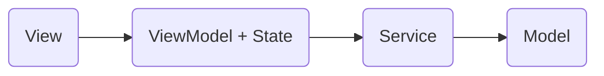
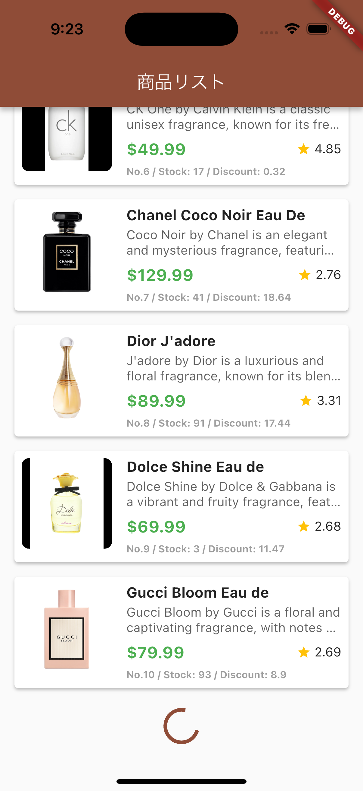
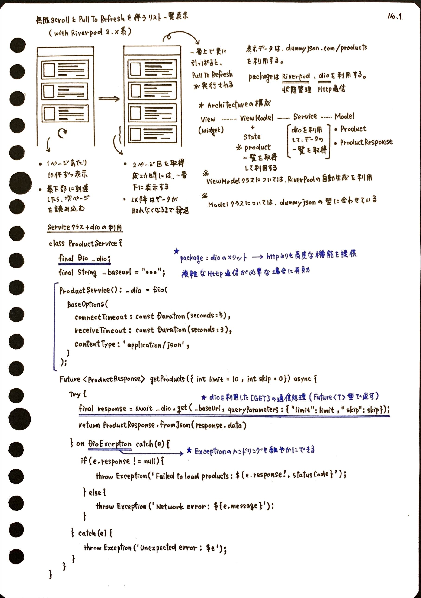
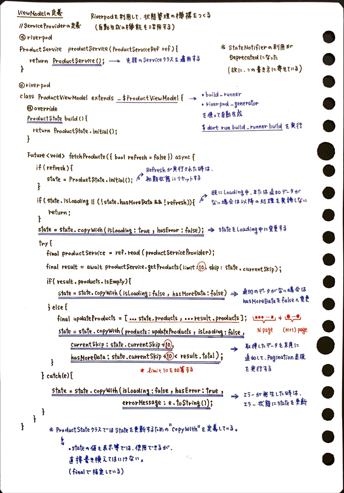
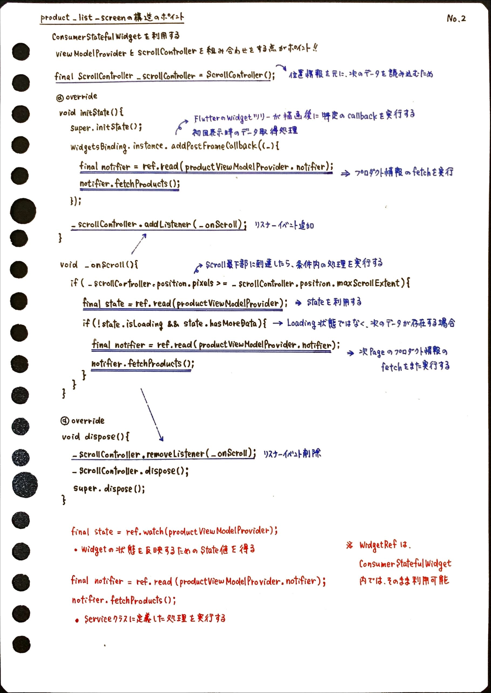
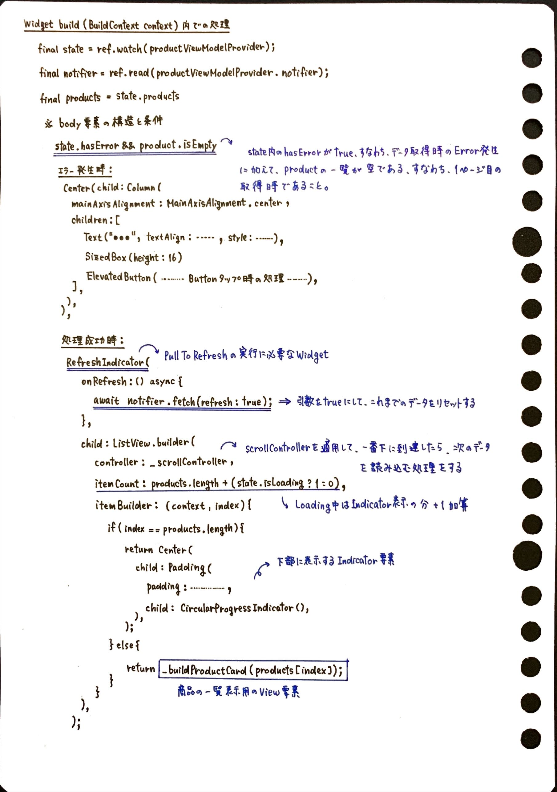

# New Rivepod & Infinite Scroll Pagination Example

## 📄 概要

Flutter ＆ Riverpod を利用して Infinite Scroll & Pull To Refreshの機能を再現したアプリサンプルになります。

### 1. 想定アーキテクチャ概要



### 2. 画面スクリーンショット

 

### 3. サンプル構築の際に利用したもの

__【サンプルで利用したパッケージ】__

- flutter_riverpod:
    - 状態管理 
    - https://pub.dev/packages/flutter_riverpod
- dio:
    - API非同期通信処理 
    - https://pub.dev/packages/dio
- build_runner:
    - コード自動生成の実行
    - https://pub.dev/packages/build_runner
- riverpod_generator:
    - RiverpodのおけるProviderの自動生成
    - https://pub.dev/packages/build_runner
- mockito:
    - UnitTestで利用するMock自動生成
    - https://pub.dev/packages/mockito

__【サンプル表示で利用したAPI】__

- GitHub:
    - https://github.com/Ovi/DummyJSON
- Document:
    - https://dummyjson.com/docs

## 🍅️ ポイント解説

__【サンプルにおける重要部分をまとめたノート】__









## 🔋 ViewModelクラスの構築に関して

ViewModelクラスのみ、Riverpodのコード自動生成を利用して作成しています。

__【自動生成実行コマンド】__

```bash
$ dart run build_runner build
```

__【ViewModelクラスの実体とUnitTest】__

① `product_view_model.dart`

<details>
<summary>全ての実装Codeはこちら</summary>

```dart
import 'package:riverpod_annotation/riverpod_annotation.dart';
import 'package:commerce_style_sample_app/view_models/product_state.dart';
import 'package:commerce_style_sample_app/services/product_service.dart';

part 'product_view_model.g.dart';

// ServiceProviderを定義する
@riverpod
ProductService productService(ProductServiceRef ref) {
  return ProductService();
}

// ViewModelProviderを定義する
// 👉 riverpod_generatorでの自動生成を利用して作成する
@riverpod
class ProductViewModel extends _$ProductViewModel {

  @override
  ProductState build() {
    // 最初はProductStateの初期状態を返す
    return ProductState.initial();
  }

  Future<void> fetchProducts({bool refresh = false}) async {
    // Refreshが実行された場合はProductStateを初期状態にリセットする
    if (refresh) {
      state = ProductState.initial();
    }
    // 既にLoading中、または、追加のデータがない場合は以降の処理を実施しない
    if (state.isLoading || (!state.hasMoreData && !refresh)) {
      return;
    }
    // ProductStateをLoading中状態に更新する
    state = state.copyWith(isLoading: true, hasError: false);
    try {
      // productServiceでの処理を実行するために、productServiceProviderを利用する
      final productService = ref.read(productServiceProvider);
      final result = await productService.getProducts(
        limit: 10,
        skip: state.currentSkip,
      );

      if (result.products.isEmpty) {
        // 追加のデータがない場合は終了フラグを立てる
        state = state.copyWith(
          isLoading: false,
          hasMoreData: false,
        );
      } else {
        // 新たに取得したプロダクト一覧情報が後に来るように、既存のリストに追加する
        final updatedProducts = [...state.products, ...result.products];
        state = state.copyWith(
          products: updatedProducts,
          isLoading: false,
          currentSkip: state.currentSkip + 10,
          hasMoreData: state.currentSkip + 10 < result.total,
        );
      }
    } catch (e) {
      // データ取得処理時にエラーが発生した場合は、エラー状態に更新する
      state = state.copyWith(
        isLoading: false,
        hasError: true,
        errorMessage: e.toString(),
      );
    }
  }
}
```
</details>

② `product_view_model_test.dart`

<details>
<summary>全ての実装Codeはこちら</summary>
```dart
import 'package:commerce_style_sample_app/models/product.dart';
import 'package:commerce_style_sample_app/models/product_response.dart';
import 'package:commerce_style_sample_app/services/product_service.dart';
import 'package:commerce_style_sample_app/view_models/product_view_model.dart';
import 'package:flutter_riverpod/flutter_riverpod.dart';
import 'package:flutter_test/flutter_test.dart';
import 'package:mockito/mockito.dart';
import 'package:mockito/annotations.dart';

@GenerateNiceMocks([MockSpec<ProductService>()])

import 'product_view_model_test.mocks.dart';

void main() {
group('PostalCodeProvider Tests', () {
late ProviderContainer container;
late MockProductService mockProductService;

    setUp(() {
      mockProductService = MockProductService();
      container = ProviderContainer(
        overrides: [
          productServiceProvider.overrideWithValue(mockProductService),
        ],
      );
      addTearDown(container.dispose);
    });

    test('should initial state should be correct', () {
      final state = container.read(productViewModelProvider);
      expect(state.products, isEmpty);
      expect(state.isLoading, isFalse);
      expect(state.hasError, isFalse);
      expect(state.errorMessage, isNull);
      expect(state.hasMoreData, isTrue);
      expect(state.currentSkip, 0);
    });

    test('should fetch successfully and have next page', () async {
      final mockProductList = [
        Product(
          id: 1,
          title: "Title Example No.1",
          description: "Description Example No.1",
          price: 9.99,
          discountPercentage: 7.17,
          rating: 4.94,
          stock: 5,
          thumbnail: "https://cdn.dummyjson.com/products/images/thumbnail.png"
        ),
        Product(
          id: 2,
          title: "Title Example No.2",
          description: "Description Example No.2",
          price: 9.99,
          discountPercentage: 7.17,
          rating: 4.94,
          stock: 5,
          thumbnail: "https://cdn.dummyjson.com/products/images/thumbnail.png"
        ),
        Product(
          id: 3,
          title: "Title Example No.3",
          description: "Description Example No.3",
          price: 9.99,
          discountPercentage: 7.17,
          rating: 4.94,
          stock: 5,
          thumbnail: "https://cdn.dummyjson.com/products/images/thumbnail.png"
        ),
        Product(
          id: 4,
          title: "Title Example No.4",
          description: "Description Example No.4",
          price: 9.99,
          discountPercentage: 7.17,
          rating: 4.94,
          stock: 5,
          thumbnail: "https://cdn.dummyjson.com/products/images/thumbnail.png"
        ),
        Product(
          id: 5,
          title: "Title Example No.5",
          description: "Description Example No.5",
          price: 9.99,
          discountPercentage: 7.17,
          rating: 4.94,
          stock: 5,
          thumbnail: "https://cdn.dummyjson.com/products/images/thumbnail.png"
        ),
        Product(
          id: 6,
          title: "Title Example No.6",
          description: "Description Example No.6",
          price: 9.99,
          discountPercentage: 7.17,
          rating: 4.94,
          stock: 5,
          thumbnail: "https://cdn.dummyjson.com/products/images/thumbnail.png"
        ),
        Product(
          id: 7,
          title: "Title Example No.7",
          description: "Description Example No.7",
          price: 9.99,
          discountPercentage: 7.17,
          rating: 4.94,
          stock: 5,
          thumbnail: "https://cdn.dummyjson.com/products/images/thumbnail.png"
        ),
        Product(
          id: 8,
          title: "Title Example No.8",
          description: "Description Example No.8",
          price: 9.99,
          discountPercentage: 7.17,
          rating: 4.94,
          stock: 5,
          thumbnail: "https://cdn.dummyjson.com/products/images/thumbnail.png"
        ),
        Product(
          id: 9,
          title: "Title Example No.9",
          description: "Description Example No.9",
          price: 9.99,
          discountPercentage: 7.17,
          rating: 4.94,
          stock: 5,
          thumbnail: "https://cdn.dummyjson.com/products/images/thumbnail.png"
        ),
        Product(
          id: 10,
          title: "Title Example No.10",
          description: "Description Example No.10",
          price: 9.99,
          discountPercentage: 7.17,
          rating: 4.94,
          stock: 5,
          thumbnail: "https://cdn.dummyjson.com/products/images/thumbnail.png"
        ),
      ];
      final mockProductResponse = ProductResponse(
          products: mockProductList,
          total: 194,
          skip: 0,
          limit: 10
      );

      when(mockProductService.getProducts(limit: 10, skip: 0)).thenAnswer(
            (_) async => mockProductResponse,
      );

      final notifier = container.read(productViewModelProvider.notifier);
      await notifier.fetchProducts();

      final state = container.read(productViewModelProvider);
      expect(state.products.length, 10);
      expect(state.isLoading, isFalse);
      expect(state.hasError, isFalse);
      expect(state.errorMessage, isNull);
      expect(state.hasMoreData, isTrue);
      expect(state.currentSkip, 10);
      verify(mockProductService.getProducts(limit: 10, skip: 0)).called(1);
    });

    test('should fetch successfully and stop next fetch', () async {
      final mockProductResponse = ProductResponse(
          products: [],
          total: 194,
          skip: 0,
          limit: 10
      );

      when(mockProductService.getProducts(limit: 10, skip: 0)).thenAnswer(
            (_) async => mockProductResponse,
      );

      final notifier = container.read(productViewModelProvider.notifier);
      await notifier.fetchProducts();

      final state = container.read(productViewModelProvider);
      expect(state.products.length, 0);
      expect(state.isLoading, isFalse);
      expect(state.hasError, isFalse);
      expect(state.errorMessage, isNull);
      expect(state.hasMoreData, isFalse);
      expect(state.currentSkip, 0);
      verify(mockProductService.getProducts(limit: 10, skip: 0)).called(1);
    });

    test('should handle error during product fetch', () async {
      const errorMessage = 'プロダクトデータの取得に失敗しました';

      when(mockProductService.getProducts(limit: 10, skip: 0)).thenThrow(
        Exception(errorMessage),
      );

      final notifier = container.read(productViewModelProvider.notifier);
      await notifier.fetchProducts();

      final state = container.read(productViewModelProvider);
      expect(state.products.length, 0);
      expect(state.isLoading, isFalse);
      expect(state.hasError, isTrue);
      expect(state.errorMessage, "Exception: プロダクトデータの取得に失敗しました");
      expect(state.hasMoreData, isTrue);
      expect(state.currentSkip, 0);
      verify(mockProductService.getProducts(limit: 10, skip: 0)).called(1);
    });
});
}
```
</details>
